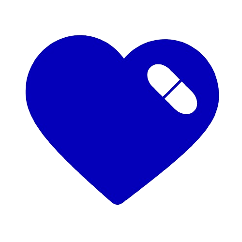

#  CareMind Mobile

[](https://flutter.dev/)
[](https://dart.dev/)
[](https://www.android.com/)
[](https://www.apple.com/ios/)
[](https://supabase.com/)
[](https://firebase.google.com/)

> **Autonomia e Segurança na Palma da Mão**

---

## 📱 Sobre o App

CareMind Mobile é a ponta de execução móvel do sistema de gerenciamento de medicamentos, desenvolvido como Trabalho de Conclusão de Curso (TCC) para o Técnico em Desenvolvimento de Sistemas no SENAI Conde Alexandre Siciliano (Jundiaí-SP).

O aplicativo foi projetado com foco total na experiência do usuário final e acessibilidade, seguindo as diretrizes WCAG (Web Content Accessibility Guidelines) para garantir que todos os usuários, independentemente de suas limitações, possam utilizar o sistema com autonomia e segurança.

### 👥 Tipos de Usuários

- **👴 Idoso**: Usuário final que recebe os lembretes de medicamentos e utiliza a interface simplificada com acessibilidade total
- **👩‍⚕️ Familiar/Cuidador**: Usuário gerenciador que cadastra medicamentos, agenda compromissos e monitora a saúde do idoso
- **👤 Individual**: Usuário autônomo que gerencia seus próprios medicamentos e compromissos de saúde

---

## ✨ Funcionalidades Exclusivas (Mobile)

### 🎨 Interface Adaptativa
- Layouts dinâmicos que se adaptam baseados no perfil do usuário (Idoso vs. Cuidador)
- Design responsivo com glassmorphism e componentes customizados
- Navegação intuitiva com feedback visual e tátil

### ♿ Acessibilidade Avançada
- Botões extra-large com área de toque ampliada
- Alto contraste otimizado para usuários com baixa visão
- Suporte completo para leitores de tela (TalkBack/VoiceOver)
- Feedback tátil com vibração personalizada

### 🗣️ Comandos de Voz Nativos
- **Speech-to-Text**: Reconhecimento de voz para comandos e cadastro
- **Text-to-Speech**: Leitura de informações e orientações
- Integração nativa com APIs do sistema operacional

### 📸 OCR Mobile Integrado
- Câmera nativa para escanear receitas médicas
- Processamento OCR com preenchimento automático de medicamentos
- Validação inteligente de informações escaneadas

### 🔔 Notificações Híbridas
- **Push Notifications** via Firebase Cloud Messaging (FCM)
- **Notificações Locais** com `flutter_local_notifications` para garantia offline
- Sistema de priorização e escalonamento inteligente

### 🔗 Deep Linking
- Integração com Amazon Alexa via `caremind://`
- Vinculação de contas e dispositivos externos
- Navegação direta para funcionalidades específicas

---

## 🛠️ Stack Tecnológica

### Framework Principal
- **Flutter 3.6.2+** com **Dart**
- Arquitetura limpa com separação de responsabilidades

### Gerência de Estado e Injeção
- **Get It** para injeção de dependências
- Arquitetura baseada em Services e Controllers

### Design e UI/UX
- **Google Fonts** para tipografia consistente
- **Wave** para backgrounds animados
- **Flutter SVG** para gráficos vetoriais
- **Smooth Page Indicator** para navegação

### Backend e Serviços
- **Supabase** para autenticação e banco de dados
- **Firebase** para push notifications
- **HTTP Client** para integrações externas

### Acessibilidade e Multimídia
- **Flutter TTS** para síntese de voz
- **Speech to Text** para reconhecimento de voz
- **Vibration** para feedback tátil
- **Permission Handler** para gerenciamento de permissões

### Utilitários
- **Image Picker** para OCR e câmera
- **QR Flutter** para códigos QR
- **Shared Preferences** para armazenamento local
- **URL Launcher** para integrações externas

---

## 🚀 Como Rodar

### Pré-requisitos
- **Flutter SDK** >= 3.6.2
- **Android Studio** (com Android SDK) ou **Xcode** (para iOS)
- **Git** para controle de versão

### Instalação e Execução

```bash
# 1. Clone o repositório
git clone https://github.com/Pincinato07/caremind_app_novo.git
cd caremind

# 2. Instale as dependências
flutter pub get

# 3. Configure as variáveis de ambiente

# 4. Execute o aplicativo
flutter run

# 5. Para build específico
flutter build apk          # Android
flutter build ios          # iOS
```

### Configuração de Ambiente
Crie um arquivo `.env` na raiz do projeto com:
```env
SUPABASE_URL=sua_url_supabase
SUPABASE_ANON_KEY=sua_chave_anonima
FCM_SERVER_KEY=sua_chave_fcm
```

---

## 📁 Estrutura de Pastas

```
lib/
├── core/                   # Núcleo da aplicação
│   ├── accessibility/      # Serviços de acessibilidade
│   ├── deep_link/         # Configuração de deep linking
│   ├── errors/            # Tratamento de erros
│   ├── injection/         # Injeção de dependências
│   ├── navigation/        # Navegação e rotas
│   ├── services/          # Serviços globais
│   ├── state/             # Gerência de estado
│   └── utils/             # Utilitários
├── models/                 # Modelos de dados
├── screens/                # Telas da aplicação
│   ├── auth/              # Autenticação
│   ├── idoso/             # Interface para idoso
│   ├── familiar/          # Interface para cuidador
│   ├── medication/        # Gestão de medicamentos
│   ├── ocr/               # Scanner de receitas
│   └── shared/            # Componentes compartilhados
├── services/               # Serviços de negócio
├── theme/                  # Temas e estilos
└── widgets/                # Widgets customizados
```

---

## 👥 Autores e Orientador

### Desenvolvedores
- **Daniel Augusto Batista**
- **João Gabriel Sacramoni Pincinato**  
- **Leonardo Destro Felix**
- **Marcos Néfi Bolonha da Silva**
- **Pedro Ribeiro**

### Orientador
- **Carlos Ribeiro** - Orientador Técnico
  - SENAI Conde Alexandre Siciliano
  - Jundiaí - São Paulo

---

## 📸 Screenshots

### Tela de Início
<div align="center">
  
</div>

### Dashboard Familiar
<div align="center">
  
</div>

### Gestão de Medicamentos
<div align="center">
  
</div>

### Perfil do Usuário
<div align="center">
  
</div>

### Configurações
<div align="center">
  
</div>

---

## 📄 Licença

**© 2025 - Todos os direitos reservados**

Este projeto é propriedade intelectual dos desenvolvedores. Não é permitida a reprodução, distribuição ou modificação sem autorização expressa.

---

<div align="center">

**💙 Desenvolvido com dedicação ao cuidado dos nossos idosos 💙**

</div>
